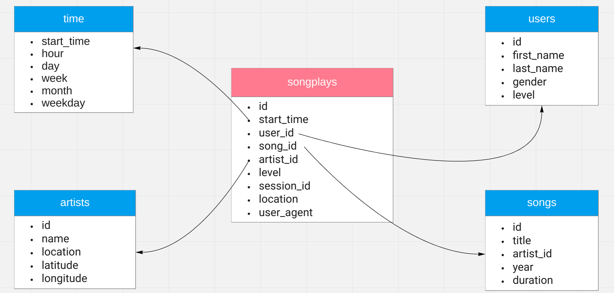

# Purpose of the Data Warehouse and the ETL pipeline

In this assignment we have a series of log files and song data files in Amazon S3 with the same format as the ones we used for the Data Modelling assignment.

For reasons already specified in this previous assignment, it is pretty complex for the analysts at Sparkify to run analytics on the songs their users are listening to. Setting up a data warehouse and a series of analytics tables they could use on it is one of the ways to go to make their work easier, especially with larger datasets, as it happens in this assignment where we have a much bigger amount of song files to process.

# Design

### Database schema

The database schema consists on a star schema which is at first sight identical to the one used in the Data Modelling assignment 

To refresh that, the schema will consist on a fact table, `songplays` that will contain:

- A reference to the **user**
- A reference to the **song**
- A reference to the **artist**
- A **timestamp** indicating when the song play was **started**
- Information on the **subscription level** under which the song was played
- The **session id** under which the song was played
- The **user agent** header containing info about the user agent (app, browser, etc.) requesting to play the song.
- The **location** (city) where the song play was triggered from

Together with the fact table the schema will contain four dimension tables. Three of them will offer more information about the user, the song and the artist respectively and the fourth one, `time`, will extend the different timestamps in the events allowing to classify the different events within different time frames.



### Sort keys and distribution keys

At this point, we do not really know which queries will be ran more frequently or if newer data will be more frequently queried than older data, so we can let Redshift sort the data automatically and not specify any sort keys.

For distribution keys, as the primary keys we are using for each of the dimension tables are unique (even though Redshift does not force this uniqueness), and also will be the columns used in joins, so all of them can make very good distribution keys.

### Other decisions

Some additional changes were needed from the schema in the Data Modelling assignment, which were:

- `id` in `songplays` cannot be of `SERIAL` type in Redshift. Its equivalent type is `IDENTITY(0,1)`
- `DECIMAL` fields specified just like that did not respect the decimal part of the original data. `DECIMAL (10, 6)` was used for longitudes and latitudes and `DECIMAL (7,2)` for song duration.
- In this assignment some location fields with more than 256 characters allocated for the type `TEXT` were found in the event files causing the ETL to break. For this reason, `VARCHAR(512)` was chosen as the type for the `location` field in `songplays`.

Additionally, `ON CONFLICT` sentences within `INSERT` statements are not valid in Redshift. In order to guarantee insertions with unique ids for `users`, `artists` and `time`, `SELECT DISTINCT` statements have been used in combination with the `row_number()` function when needed (for `users`, so the last user level is kept, and for `artists`, so the row we try to store for an artist is the one that includes a location, if this exists)

### ETL Pipeline script

The ETL Pipeline script is an easy script that first connects to Redshift using the credentials available in `dwh.cfg`, then copies the information from S3 to the two staging tables `staging_events` and `staging_songs`, and finally executes five different `INSERT` queries available in `sql_queries.py` that extract and transform the data from the staging tables into the five analytics tables.

# Project structure

The project contains the following files. and directories:

- `sql_queries.py`: Python file that contains all the SQL queries needed at the `create_tables.py` script and the ETL pipeline script. 
- `create_tables.py`: Python script that creates the Redshift tables, wiping out their data if they happen to contain some information.
- `etl.py`: Python script that executes the ETL pipeline that will copy the data available in the cloud into two staging tables, and extract and transform the data from these two staging tables in order to create the analytics tables.
- `test.ipynb:` Jupyter notebook with different SQL queries used to verify the correct behaviour of the ETL.
- `dwh.cfg:` Configuration file with the different variables and credentials needed for this assignment.

# Execution

To run this project it is precise to have:

- A Python installation or a Python virtual environment with all the imported libraries installed
- A Redshift cluster running
- The correct credentials in `dwh.cfg`

With the prerequisites described above all set, it is only necessary to run first the `create_tables.py` script

```
python create_tables.py
```

Followed by the ETL pipeline script

```
python etl.py
```

# Example queries

List of users with their membership levels sorted by number of song plays 

```
SELECT user_id, level, count(1) FROM songplays GROUP BY user_id, level ORDER BY count DESC
```

Amount of song plays done under the different membership levels

```
SELECT level, count(1) FROM songplays GROUP BY level ORDER BY level DESC
```

Find the 5 users with more songplays with their first name, last_name and number of songplays

```
SELECT users.first_name, users.last_name, count(1) FROM songplays JOIN users ON songplays.user_id = users.id GROUP BY users.first_name, users.last_name ORDER BY count DESC LIMIT 5
```

Find the name of the 5 most listened artists

```
SELECT artists.name AS artist_name, count(1) FROM songplays JOIN artists ON songplays.artist_id = artists.id GROUP BY artist_name ORDER BY count DESC LIMIT 5
```

Find the title of the 10 most listened songs

```
SELECT artists.name AS artist_name, songs.title, count(1) FROM songplays JOIN artists ON songplays.artist_id = artists.id JOIN songs ON songplays.song_id = songs.id GROUP BY artists.name, songs.title ORDER BY count DESC LIMIT 10
```

Find the 5 hour time frames with more song plays:

```
SELECT time.hour, count(1) FROM songplays JOIN time ON songplays.start_time = time.start_time GROUP BY time.hour ORDER BY count DESC LIMIT 5
```

