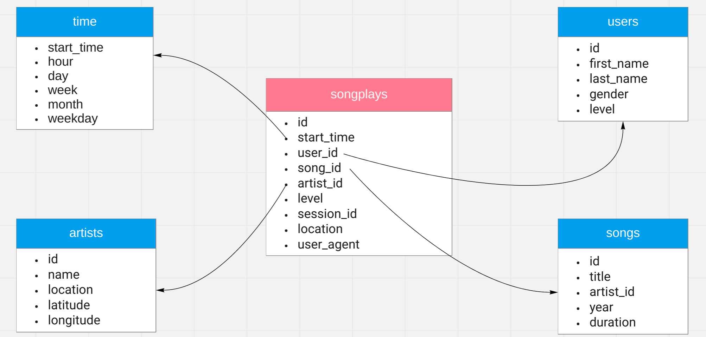

# Purpose of the Data Warehouse and the ETL pipeline

The startup Sparkify keeps growing and so is the data they are processing. To meet with the current demands regarding Data Analytics, it has been determined to move their data from a data warehouse to a data lake.

This project consists on an ETL pipeline that will extract the data from Sparkify's log and song files, process it with Spark and load it back into S3 as a set of dimensional tables using the same star schema we have been using in previous assignments. 

# Design

### Tables design

The exported table conform a star schema which is identical to the ones used in the two previous assignments 

To refresh that, the schema will consist on a fact table, `songplays` that will contain:

- A reference to the **user**
- A reference to the **song**
- A reference to the **artist**
- A **timestamp** indicating when the song play was **started**
- Information on the **subscription level** under which the song was played
- The **session id** under which the song was played
- The **user agent** header containing info about the user agent (app, browser, etc.) requesting to play the song.
- The **location** (city) where the song play was triggered from

Together with the fact table the schema will contain four dimension tables. Three of them will offer more information about the user, the song and the artist respectively and the fourth one, `time`, will extend the different timestamps in the events allowing to classify the different events within different time frames.



### Columns and Data types

The five dimensional tables generated have been exported with the following columns and data types:

##### songs

```
[id: string, title: string, duration: double, year: int, artist_id: string]
```

##### artists

```
[id: string, name: string, location: string, latitude: double, longitude: double]
```

##### users

```
[id: string, first_name: string, last_name: string, gender: string, level: string]
```

##### time

```
[start_time: timestamp, week: int, day: int, hour: int, weekday: int, year: int, month: int]
```

##### songplays

```
[start_time: timestamp, user_id: string, level: string, song_id: string, artist_id: string, session_id: bigint, location: string, user_agent: string, year: int, month: int]
```

Most of these types have been generated by Spark and its schema-on-read functionality and considered good enough.

Only the **time** dimension and their fields have been generated using first two user defined functions and different internal Spark functions afterwards to get information relative to the year, month, week, etc.

Also the start_time column in **songplays** has been manually generated as a timestamp type is more readable than the bigint timestamp using microseconds that is present in the logs.

Finally, in order to be able to store **songplays** partitioned by year and month as demanded, these two columns have been added to this table.

### ETL Pipeline script

The etl script does the following:

- Calls a function that creates and returns a spark session
- Defines an S3 location where to read the song and log data from
- Defines an S3 location where to write the five parquet files that will be generated for each dimension table
- Calls a function that extracts the song files data and processes it obtaining as result the **songs** and **artists** dimension tables, writing them to the specified location in S3
- Calls another function that extracts the log files data and processes it obtaining as result the **users**, **time**, and **songplays** dimension tables, writing them to the specified location in S3. In order to create the fact table **songplays**, the **songs** and **artists** dimensions we obtained in the previous step are needed.

# Project structure

The project contains the following files. and directories:

- `etl.py`: Python script that executes the ETL pipeline that will copy the data available in S3, and transform it using Spark into five dimensional tables to be stored as parquet files in a different location also in S3.
- `etl-test.ipynb:` Jupyter notebook that loads the dimensional tables created in S3 and runs some test and example queries on them.
- `dl.cfg:` Configuration file with the different variables and credentials needed for this assignment.

# Execution

Though this script can be ran in any local instance of Spark, doing it so will take several hours. That is why it is more convenient to import it to an AWS EMR cluster and run it there. Also it is convenient that the script runs in Spark 2.4.x

Once the EMR cluster is available in AWS and allows SSH connections, it would be necessary to connect into its master node using SSH. A guide on how to do it can be found [here](https://docs.aws.amazon.com/emr/latest/ManagementGuide/emr-connect-master-node-ssh.html)

Once connected to the EMR cluster master node, the fastest way to get this project would be to clone it from Github. For this Git needs to be installed first.

```
sudo yum install git
```

Then, this repository can be cloned

```
git clone https://github.com/deadbyaudio/data-science-ng.git
```

And the project directory accessed

```
cd data-science-ng/04-data-lake
```

Then, the AWS credentials should be introduced in the file `dl.cfg`. Identically the output location where the parquet files will be created can be updated there.

And finally it is possible to run the ETL script with the following command

```
/usr/bin/spark-submit --master yarn ./etl.py
```

If an error reporting that **configparser** module is not present appears when executing the script, this could be easily fixed by installing such module with the following command

```
sudo pip install configparser
```

# Running queries

To run the following example queries in SQL with Spark, three previous steps are required:

Create a Spark session:

```
spark = SparkSession \
        .builder \
        .config("spark.jars.packages", "org.apache.hadoop:hadoop-aws:2.7.0") \
    	.getOrCreate()
```

First, we need Spark to read each of the five dimensional tables we created in S3. This will create a Spark dataframe for each of them.

```
song_df = spark.read.parquet('s3a://<s3-location>/songs.parquet')
artist_df = spark.read.parquet('s3a://<s3-location>/artists.parquet')
user_df = spark.read.parquet('s3a://<s3-location>/users.parquet')
time_df = spark.read.parquet('s3a://<s3-location>/time.parquet')
songplay_df = spark.read.parquet('s3a://<s3-location>/songplays.parquet')
```

Then, we need to create temporary views for each of the imported dataframes we got. Temporary views allow us to use SQL to query our data.

```
song_df.createOrReplaceTempView("songs")
artist_df.createOrReplaceTempView("artists")
user_df.createOrReplaceTempView("users")
time_df.createOrReplaceTempView("time")
songplay_df.createOrReplaceTempView("songplays")
```

And once we have done this, we can run any query on our recently created views using SQL using `spark.sql`

# Example queries

Users and their membership levels sorted by amount of songplays

```
spark.sql(
"""
	SELECT 	 user_id, 
			level, 
			count(1) AS count 
	FROM songplays 
	GROUP BY user_id, level ORDER BY count DESC
"""
).show()
```

Amount of song plays done under the different membership levels

```
spark.sql(
"""
	SELECT   level, 
			count(1) FROM songplays 
	GROUP BY level 
	ORDER BY level DESC
"""
).show()
```

Find the 5 users with more songplays with their first name, last_name and number of songplays

```
spark.sql(
"""
	SELECT 	users.first_name, 
			users.last_name, 
			count(1) AS count 
	FROM songplays 
	JOIN users ON songplays.user_id = users.id 
	GROUP BY users.first_name, users.last_name 
	ORDER BY count DESC 
	LIMIT 5
"""
).show()
```

Find the name of the 5 most listened artists

```
spark.sql(
"""
	SELECT   artists.name AS artist_name, 
			count(1) AS count 
	FROM songplays 
	JOIN artists ON songplays.artist_id = artists.id 
	GROUP BY artist_name 
	ORDER BY count DESC 
	LIMIT 5
"""
).show()
```

Find the title of the 10 most listened songs

```
spark.sql(
"""
	SELECT   artists.name AS artist_name, 
			songs.title, 
			count(1) as count FROM songplays 
			JOIN artists ON songplays.artist_id = artists.id 
			JOIN songs ON songplays.song_id = songs.id 
			GROUP BY artists.name, songs.title 
			ORDER BY count DESC 
			LIMIT 10
"""
).show()	
```

Find the 5 hour time frames with more song plays:

```
spark.sql(
"""
	SELECT time.hour, 
	count(1) AS count FROM songplays 
	JOIN time ON songplays.start_time = time.start_time 
	GROUP BY time.hour 
	ORDER BY count DESC 
	LIMIT 5
"""
).show()
```
