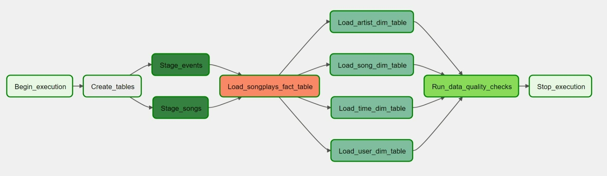

# Airflow Data Pipeline

This project consists on an Airflow data pipeline that will extract the data from Sparkify's log and song files, load it respectively into two different staging tables in Redshift, and then use the information from these staging tables to create one fact table and four dimension tables for a star schema. The pipeline contains a last step where an integrity check is performed to ensure data quality.

### Data Pipeline Graph



## Decisions taken

- In order to simulate better the execution of the DAG every hour the `max_active_runs` setting has been set to 1. This way there wont be multiple executions of the DAG which could involve operations (e.g. deleting tables) that may obstruct a previous running execution of the same DAG.
- In order to limit the number of executions and the number of operations happening in Redshift, because they cost money, I have added an `end_date` setting that limits the DAG to three executions. Feel free to modify or remove this setting for running more iterations of the DAG.  

## Project structure

The project contains the following files. and directories:

- `docker-compose`: Docker compose file with the instructions necessary to download, set up and run all the necessary containers needed for running Airflow locally.
- `dags/create_tables.sql`: Provided SQL script that contains the SQL sentences to create all the necessary tables in Redshift.
- `dags/udac_example_dag.py`: Implementation of the DAG.
- `plugins/helpers/sql_queries.py`: Provided Python script that contains queries describing how to extract the data needed to create the fact and dimension tables.
- `operators/data_quality.py`: The operator that takes care of the data quality checks.
- `operators/load_dimension.py`: Operator that creates the given dimension table from the previously created staging tables.
- `operators/load_fact.py`: Operator that creates the fact table from the previously created staging tables.
- `stage_redshift.py`: Operator that moves the information from S3 to two staging tables in Redshift.
- `test.ipynb`: Jupyter notebook to run some extra queries over the created tables.

## Execution

#### Airflow version

This assignment has been developed using Airflow v2.1.2. If you don't use the provided docker compose, make sure you use the same or a similar version.

### Execution steps

To execute the data pipeline the following steps are needed:

1. Clone the repository

   ```
   git clone https://github.com/deadbyaudio/data-science-ng.git
   ```

2. Go to the project directory

   ```
   cd data-science-ng/05-data-pipelines
   ```

3. Run the docker compose file and wait for all the containers to be running

   ```
   docker-compose up
   ```

4. Connect with your browser to the local Airflow webserver

   ```
   http://localhost:8080
   ```

5. Authenticate with the default credentials

   ```
   username: airflow
   password: airflow
   ```

6. Add connections for

   - AWS credentials
     - Conn Id: `aws_credentials`
     - Conn Type: `Amazon Web Services`
     - Login: <AWS Access Key ID>
     - Password: <AWS Secret Access Key>
   - Redshift
     - Conn Id: `redshift`
     - Conn Type: `Postgres`
     - Host: <Redshift host address>
     - Schema: <Redshift schema>
     - Login: <Redshift username>
     - Password: <Redshift password>
     - Port: `5439`

7. Add a variable for `load_mode` with any of these values

   - `append-only`: For just appending the data in the fact and dimension tables in every iteration
   - `delete-load`: Deleting existing data for fact and dimension tables before loading the data in every iteration

8. Run the DAG `udac_example_dag` from the Airflow UI.
